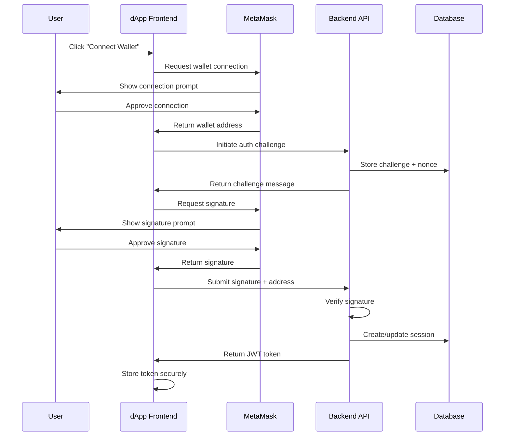

# Secure Wallet Authentication Flow

## Overview

This document describes the secure wallet-based authentication flow for BAX's dApp, where users authenticate with MetaMask to access their encrypted payroll information stored off-chain.

## Authentication Flow Architecture

### 1. Wallet Connection Flow



### 2. Detailed Authentication Steps

#### Step 1: Wallet Connection
1. User clicks "Connect Wallet" button
2. Frontend requests connection to MetaMask
3. MetaMask prompts user for permission
4. Upon approval, MetaMask returns the wallet address
5. Frontend validates the address format

#### Step 2: Challenge Generation
1. Frontend sends wallet address to backend `/auth/challenge` endpoint
2. Backend generates a cryptographically secure random nonce
3. Creates challenge message: `"BAX Authentication: ${nonce}:${timestamp}:${walletAddress}"`
4. Stores challenge in Redis with 5-minute TTL
5. Returns challenge message to frontend

#### Step 3: Signature Request
1. Frontend requests signature from MetaMask using the challenge message
2. MetaMask displays the challenge for user verification
3. User approves the signature request
4. MetaMask returns the signature (r, s, v values)

#### Step 4: Signature Verification
1. Frontend sends wallet address, challenge, and signature to backend
2. Backend retrieves original challenge from Redis
3. Verifies signature using Ethereum's ecrecover function
4. Validates that recovered address matches the provided address
5. Checks challenge expiration and replay protection

#### Step 5: Session Creation
1. Backend generates JWT token with wallet address and permissions
2. Creates secure session in database
3. Returns JWT token to frontend
4. Frontend stores token in secure HTTP-only cookie

## Five Critical Security Risks and Mitigations

### 1. Replay Attacks

**Risk**: An attacker intercepts a valid signature and replays it to gain unauthorized access.

**Why it's a threat**: 
- Signatures are deterministic and can be reused
- Without proper protection, valid signatures remain valid indefinitely
- Attackers can capture signatures from network traffic or compromised clients

**Mitigation**:
- Implement time-based nonces with short expiration (5 minutes)
- Use unique challenge messages for each authentication attempt
- Store used nonces in Redis with TTL to prevent reuse
- Include timestamp in challenge message for additional validation

```javascript
// Challenge generation with replay protection
const nonce = crypto.randomBytes(32).toString('hex');
const timestamp = Date.now();
const challenge = `BAX Authentication: ${nonce}:${timestamp}:${walletAddress}`;
await redis.setex(`challenge:${walletAddress}`, 300, challenge);
```

### 2. Message Manipulation

**Risk**: Attackers modify the challenge message before signing to trick users into signing malicious content.

**Why it's a threat**:
- Users might not carefully read the challenge message
- Malicious dApps could substitute challenge content
- Phishing attacks could use similar-looking domains

**Mitigation**:
- Use domain-specific prefixes in challenge messages
- Implement message format validation on both client and server
- Display challenge clearly in MetaMask with domain verification
- Use structured challenge format with checksums

```javascript
// Structured challenge with validation
const challengeData = {
  domain: 'bax.com',
  action: 'authentication',
  nonce: crypto.randomBytes(16).toString('hex'),
  timestamp: Date.now(),
  walletAddress: address.toLowerCase()
};
const challenge = `BAX Authentication: ${JSON.stringify(challengeData)}`;
```

### 3. Session Hijacking

**Risk**: Attackers steal JWT tokens or session cookies to impersonate users.

**Why it's a threat**:
- JWT tokens can be intercepted from network traffic
- Browser storage is vulnerable to XSS attacks
- Session cookies can be stolen via various attack vectors

**Mitigation**:
- Use HTTP-only cookies for token storage
- Implement short token expiration times (15-30 minutes)
- Use refresh tokens with rotation
- Implement token binding to IP address or user agent
- Use secure cookie flags (Secure, SameSite, HttpOnly)

```javascript
// Secure token storage
res.cookie('authToken', jwt, {
  httpOnly: true,
  secure: true,
  sameSite: 'strict',
  maxAge: 15 * 60 * 1000 // 15 minutes
});
```

### 4. Wallet Address Validation

**Risk**: Attackers use invalid or malicious wallet addresses to bypass authentication.

**Why it's a threat**:
- Invalid addresses could cause application errors
- Malicious addresses might be used for social engineering
- Address format validation prevents injection attacks

**Mitigation**:
- Validate Ethereum address format using checksum validation
- Implement address normalization (lowercase with checksum)
- Use libraries like `ethers.js` for address validation
- Implement address blacklisting for known malicious addresses

```javascript
// Address validation
import { ethers } from 'ethers';

function validateAddress(address) {
  try {
    const normalizedAddress = ethers.getAddress(address);
    return ethers.isAddress(normalizedAddress);
  } catch (error) {
    return false;
  }
}
```

### 5. Frontend Security Vulnerabilities

**Risk**: Client-side vulnerabilities expose authentication logic and sensitive data.

**Why it's a threat**:
- XSS attacks can steal tokens and wallet data
- CSRF attacks can perform unauthorized actions
- Client-side code is visible and modifiable by attackers

**Mitigation**:
- Implement Content Security Policy (CSP) headers
- Use Subresource Integrity (SRI) for external scripts
- Implement CSRF tokens for state-changing operations
- Sanitize all user inputs
- Use secure coding practices and regular security audits

```javascript
// CSP implementation
app.use((req, res, next) => {
  res.setHeader('Content-Security-Policy', 
    "default-src 'self'; " +
    "script-src 'self' 'unsafe-inline' https://cdn.ethers.io; " +
    "connect-src 'self' https://api.bax.com; " +
    "frame-ancestors 'none';"
  );
  next();
});
```

## Additional Security Considerations

### Rate Limiting
- Implement rate limiting on authentication endpoints
- Use exponential backoff for failed attempts
- Monitor for suspicious authentication patterns

### Monitoring and Logging
- Log all authentication attempts with timestamps
- Monitor for unusual patterns or failed attempts
- Implement alerting for security events

### Key Management
- Store signing keys securely in AWS Secrets Manager
- Use key rotation policies
- Implement proper key derivation functions

### Network Security
- Use HTTPS for all communications
- Implement proper TLS configuration
- Use secure WebSocket connections for real-time features

## Implementation Recommendations

1. **Use established libraries**: Leverage `ethers.js` or `web3.js` for Ethereum interactions
2. **Implement proper error handling**: Don't expose sensitive information in error messages
3. **Regular security audits**: Conduct periodic security reviews
4. **Penetration testing**: Perform regular penetration tests on the authentication flow
5. **User education**: Provide clear instructions for users on secure wallet usage

This authentication flow provides a secure foundation for wallet-based authentication while addressing the most common security risks in Web3 applications.
